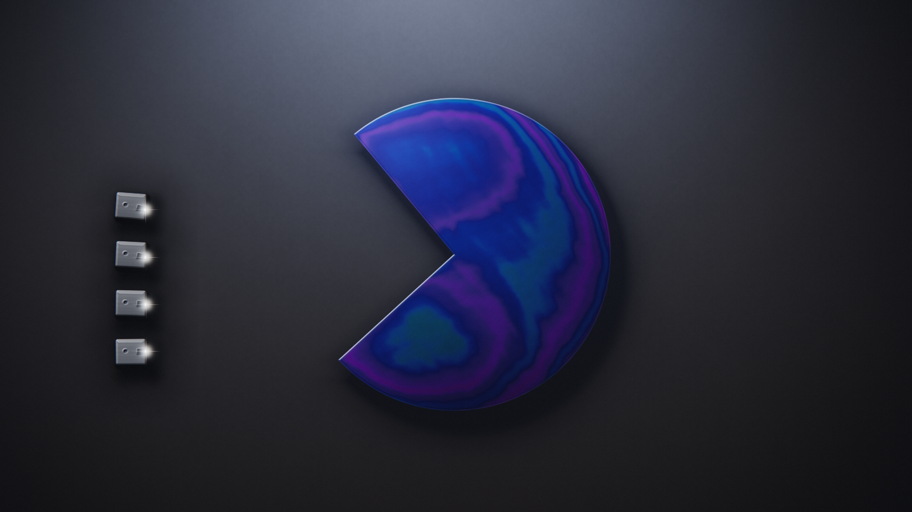

# PRISMA DUEL

A top-down, turn-based laser dogfight where the weapon is a real spectral ray
tracer and the terrain is made of dichroic prisms. Fire through one and your
beam refracts, disperses into a rainbow fan, and can strike people who were
never in your line of sight.



## Run it

**Practice, no server needed** — open `index.html` in a browser and pick
*Practice — 3 bots*.

**Multiplayer**

```bash
cd server && npm install      # only dependency is `ws`
node server.js                # PORT=8080 by default
```

Then open the printed URL, enter a room code (or leave it blank to matchmake)
and hit *Join room*. Up to 4 fighters per room.

The server only does matchmaking and relays the WebRTC handshake. Once the mesh
is up, **all gameplay traffic is peer-to-peer** — you can kill the server
mid-match and play on.

## How a turn works

Each turn you commit four things, then everyone's orders execute simultaneously
over a ~4 second animation:

| Order | Effect |
|---|---|
| **Course** | Drag the handle. The shaded wedge is what your ship can physically reach this turn. |
| **Throttle** | How fast you go. Speed costs you agility — a fast run cannot bring guns to bear. |
| **Power split** | Thrust versus laser recharge. They are directly opposed: fly hard and you reload slowly. |
| **Fire** | Only when charged. Firing consumes the whole charge and suppresses shield regeneration. |

Damage is **per millisecond of dwell**. A graze costs a few points; holding a
target in the beam for a whole turn is fatal. Because the beam is welded to your
nose, hitting anything means turning to track — which is exactly what your
throttle just made harder.

Shields absorb before hull and regenerate only on turns you do not fire. The
arena walls are mirrors, the prisms are solid cover, and your own bank shot can
come back and hit you.

**The walls close in.** From turn 7 the mirrored box tightens, and once it is as
small as it can go it starts to collapse, damaging everyone by an escalating
amount. Two cautious pilots cannot circle each other forever — verified, with no
shots fired at all, every match still ends by turn 36.

If you do not commit in time, your ship holds its last course.

## Layout

```
index.html      the shipped game — one self-contained file, no dependencies
src/core.js     deterministic simulation core (the rules)
src/core.test.js  27 tests: determinism, rules, and arena invariants
src/net.js      WebRTC mesh + lockstep client
src/game.js     turn loop, orders, preview, netcode glue
src/hud.{css,html}
server/         matchmaking + signalling only
build.js        assembles index.html from src/  (node build.js [--check])
tools/          render/measurement helpers used during development
```

`index.html` is generated. Edit the files in `src/` and run `node build.js`.

## Why it stays in sync without a server

The netcode is peer-to-peer lockstep with no authority, so the simulation must
be bit-identical on every client. `src/core.js` is therefore pure — no DOM, no
wall clock, no `Math.random` — and each turn's trajectory is precomputed once
into a fixed 96-substep path that every peer walks in the same order.

Only the **arbiter** (the lowest-numbered connected peer) declares a turn, and
every client, arbiter included, starts the turn from the resulting `resolve`
event. That single code path is what stops a client who commits last from
resolving a different move set than the one the arbiter filled in on timeout.

Verified between two live browsers: an ordinary turn and a turn where a player
timed out both ended with identical state hashes on both peers.

## Tests

```bash
node src/core.test.js          # 27 assertions: rules, determinism, invariants
node build.js --check          # index.html is in sync with src/
cd server && node test-signalling.js   # 52 assertions over every server path
cd server && node test-headless.js     # 45 assertions, 4 real browsers,
                                       # a real 6-link WebRTC mesh
```

Current status: **27/27**, **52/52**, **45/45**. The browser suite spawns four
headless Chromium processes and needs a reasonably idle machine — under heavy
CPU contention its final "mesh re-formed" step can time out.

Balance is measured rather than guessed: 10 consecutive 4-bot matches all
reached a decision, median 21 turns, longest 32, with wins spread across all
four seats.
